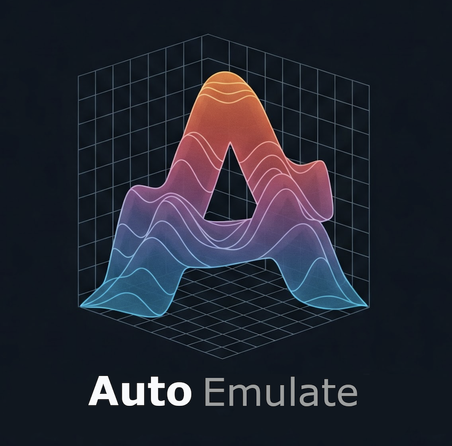

# AutoEmulate <a href="https://alan-turing-institute.github.io/autoemulate/"></a>


[](https://codecov.io/gh/alan-turing-institute/autoemulate)
[](https://github.com/psf/black)
[](#contributors)
[](https://alan-turing-institute.github.io/autoemulate/)

<!-- SPHINX-START -->
Simulations of physical systems are often slow and need lots of compute, which makes them unpractical for real-world applications like digital twins, or when they have to run thousands of times for sensitivity analyses. The goal of `AutoEmulate` is to make it easy to replace simulations with fast, accurate emulators. To do this, `AutoEmulate` automatically fits and compares various emulators, ranging from simple models like Radial Basis Functions and Second Order Polynomials to more complex models like Support Vector Machines, Gaussian Processes and Conditional Neural Processes to find the best emulator for a simulation. 

The project is in early development. 

## Installation

`AutoEmulate` requires Python `>=3.10` and `<3.13`.

There's lots of development at the moment, so we recommend installing the most current version from GitHub:

```bash
pip install git+https://github.com/alan-turing-institute/autoemulate.git
```

There's also a release on PyPI:

```bash
pip install autoemulate
```

For contributors using [Poetry](https://python-poetry.org/):

```bash
git clone https://github.com/alan-turing-institute/autoemulate.git
cd autoemulate
poetry install
```

## Quick start

```python
import numpy as np
from autoemulate.compare import AutoEmulate
from autoemulate.experimental_design import LatinHypercube
from autoemulate.simulations.projectile import simulate_projectile

# sample from a simulation
lhd = LatinHypercube([(-5., 1.), (0., 1000.)])
X = lhd.sample(100)
y = np.array([simulate_projectile(x) for x in X])

# compare emulators
ae = AutoEmulate()
ae.setup(X, y)
best_emulator = ae.compare() 

# cross-validation results
ae.summarise_cv() 
ae.plot_cv()

# test set results for the best emulator
ae.evaluate(best_emulator) 
ae.plot_eval(best_emulator)

# refit on full data and emulate!
emulator = ae.refit(best_emulator) 
emulator.predict(X)

# global sensitivity analysis
si = ae.sensitivity_analysis(emulator)
ae.plot_sensitivity_analysis(si)
```

## Documentation

You can find tutorials, FAQs and the API reference [here](https://alan-turing-institute.github.io/autoemulate/). The documentation is still work in progress.

## Contributors

<!-- ALL-CONTRIBUTORS-LIST:START - Do not remove or modify this section -->
<!-- prettier-ignore-start -->
<!-- markdownlint-disable -->
<table>
  <tbody>
    <tr>
      <td align="center" valign="top" width="14.28%"><a href="http://www.westerling.nu"><br /><sub><b>Kalle Westerling</b></sub></a><br /><a href="#doc-kallewesterling" title="Documentation">📖</a> <a href="#code-kallewesterling" title="Code">💻</a> <a href="#content-kallewesterling" title="Content">🖋</a></td>
      <td align="center" valign="top" width="14.28%"><a href="https://bryanli.io"><br /><sub><b>Bryan M. Li</b></sub></a><br /><a href="#code-bryanlimy" title="Code">💻</a></td>
      <td align="center" valign="top" width="14.28%"><a href="https://github.com/mastoffel"><br /><sub><b>martin</b></sub></a><br /><a href="#code-mastoffel" title="Code">💻</a> <a href="#ideas-mastoffel" title="Ideas, Planning, & Feedback">🤔</a> <a href="#doc-mastoffel" title="Documentation">📖</a> <a href="#maintenance-mastoffel" title="Maintenance">🚧</a> <a href="#research-mastoffel" title="Research">🔬</a> <a href="#review-mastoffel" title="Reviewed Pull Requests">👀</a></td>
      <td align="center" valign="top" width="14.28%"><a href="https://github.com/edaub"><br /><sub><b>Eric Daub</b></sub></a><br /><a href="#ideas-edaub" title="Ideas, Planning, & Feedback">🤔</a> <a href="#projectManagement-edaub" title="Project Management">📆</a> <a href="#review-edaub" title="Reviewed Pull Requests">👀</a> <a href="#code-edaub" title="Code">💻</a></td>
      <td align="center" valign="top" width="14.28%"><a href="https://github.com/snie007"><br /><sub><b>steven niederer</b></sub></a><br /><a href="#ideas-snie007" title="Ideas, Planning, & Feedback">🤔</a> <a href="#content-snie007" title="Content">🖋</a> <a href="#projectManagement-snie007" title="Project Management">📆</a></td>
      <td align="center" valign="top" width="14.28%"><a href="https://github.com/MaxBalmus"><br /><sub><b>Maximilian Balmus</b></sub></a><br /><a href="#code-MaxBalmus" title="Code">💻</a> <a href="#bug-MaxBalmus" title="Bug reports">🐛</a></td>
      <td align="center" valign="top" width="14.28%"><a href="https://github.com/aranas"><br /><sub><b>Sophie Arana</b></sub></a><br /><a href="#content-aranas" title="Content">🖋</a> <a href="#doc-aranas" title="Documentation">📖</a> <a href="#projectManagement-aranas" title="Project Management">📆</a></td>
      <td align="center" valign="top" width="14.28%"><a href="https://github.com/marjanfamili"><br /><sub><b>Marjan Famili</b></sub></a><br /><a href="#code-marjanfamili" title="Code">💻</a> <a href="#ideas-marjanfamili" title="Ideas, Planning, & Feedback">🤔</a> <a href="#doc-marjanfamili" title="Documentation">📖</a></td>
      <td align="center" valign="top" width="14.28%"><a href="https://github.com/radka-j"><br /><sub><b>Radka Jersakova</b></sub></a><br /><a href="#code-radka-j" title="Code">💻</a> <a href="#projectManagement-radka-j" title="Project Management">📆</a> <a href="#maintenance-radka-j" title="Maintenance">🚧</a> <a href="#ideas-radka-j" title="Ideas, Planning, & Feedback">🤔</a></td>
    </tr>
    <tr>
      <td align="center" valign="top" width="14.28%"><a href="https://github.com/aduncan001"><br /><sub><b>Andrew Duncan</b></sub></a><br /><a href="#ideas-aduncan001" title="Ideas, Planning, & Feedback">🤔</a> <a href="#projectManagement-aduncan001" title="Project Management">📆</a></td>
    </tr>
  </tbody>
</table>

<!-- markdownlint-restore -->
<!-- prettier-ignore-end -->

<!-- ALL-CONTRIBUTORS-LIST:END -->
