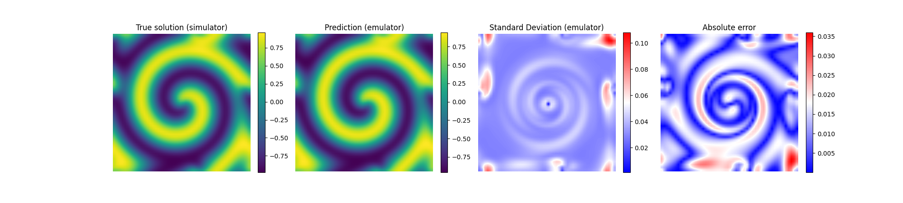

# Summary

Computational simulations lie at the heart of modern science and engineering, but they are often slow and computationally costly. This poses a significant bottleneck. A common solution is to use emulators: fast, cheap models trained to approximate the simulator. However, constructing these requires substantial expertise. AutoEmulate is a low-code Python package for emulation workflows, making it easy to replace simulations with fast, accurate emulators. In version 1.0, AutoEmulate has been fully refactored to use PyTorch as a backend, enabling GPU acceleration, automatic differentiation, and seamless integration with the broader PyTorch ecosystem. The toolkit has also been extended with easy-to-use interfaces for common emulation tasks, including model calibration; determining which input values are most likely to have generated real-world observations; and active learning, where simulations are chosen to improve emulator performance at minimal computational cost. Together these updates make AutoEmulate uniquely suited to running performant end-to-end emulation workflows.

# Statement of need

To understand complex real-world systems, researchers and engineers often construct computer simulations. These can be computationally expensive and take minutes, hours or even days to run. A solution to this bottleneck is to approximate simulations with emulators, which can be orders of magnitudes faster [@kennedy_ohagan_2000]. Emulators are key to enabling any computationally expensive downstream tasks that require generating predictions for a large number of inputs. These tasks include sensitivity analysis to quantify how much each input parameter affects the output, and model calibration to identify input values most likely to have generated real-world observations.

Emulation requires significant expertise in machine learning as well as familiarity with a broad and evolving ecosystem of tools for model training and downstream tasks. This creates a barrier to entry for domain researchers whose focus is on the underlying scientific problem. AutoEmulate [@autoemulate] lowers the barrier to entry by automating the entire emulator construction process (training, evaluation, model selection, and hyperparameter tuning). This makes emulation accessible to non-specialists while also offering a reference set of cutting-edge emulators, from classical approaches (e.g. Gaussian Processes) to modern deep learning methods, enabling benchmarking for experienced users.

AutoEmulate v1.0 introduces easy to use interfaces for common emulation tasks. By providing these within a single package, the package enables users to construct sequential workflows. For example, sensitivity analysis can be applied to narrow the parameter space to a few key variables before calibrating this reduced set against real world data.  AutoEmulate also supports direct integration of custom simulators and active learning, in which the tool adaptively selects informative simulations to run to improve emulator performance at minimal computational cost.

AutoEmulate was originally built on scikit-learn, which is well suited for traditional machine learning but less flexible for complex workflows. Version 1.0 introduces a PyTorch [@pytorch] backend that provides GPU acceleration for faster training and inference and automatic differentiation via PyTorch’s autograd system. It also makes AutoEmulate easy to integrate with other PyTorch-based tools. For example, the PyTorch refactor enables fast Bayesian model calibration using gradient-based inference methods such as Hamiltonian Monte Carlo exposed through Pyro [@pyro].

AutoEmulate fills a gap in the current landscape of emulation tools as it is both accessible to newcomers and powerful enough for advanced users. It also uniquely combines emulator training with support for a wide range of downstream tasks such as sensitivity analysis, model calibration adn active learning.

# Example usage

The AutoEmulate documentation provides a comprehensive set of [tutorials](https://alan-turing-institute.github.io/autoemulate/tutorials/index.html) showcasing all functionality. We are also collecting case studies demonstrating how to use AutoEmulate for real-world problems and complex workflows, available [here](https://github.com/alan-turing-institute/autoemulate/tree/main/case_studies). Below we provide a brief overview of the main features.

The most general use case for AutoEmulate is emulator construction. AutoEmulate takes as input `x`, `y` simulated data where `x` is a 2D tensor containing simulation parameters in columns and their values in rows, and `y` is an array containing the corresponding simulation outputs. Given data, AutoEmulate constructs an emulator in just a few lines of code:

```python
from autoemulate import AutoEmulate

ae = AutoEmulate(x, y)

best = ae.best_result()
emulator = best.model
```

Under the hood, the above runs a search over a number of emulator models, performs hyperparameter tuning and compares models using cross validation. Each model is stored along with hyperparameter values and performance metrics in a `Results` object. The user can then easily extract the best performing emulator.

AutoEmulate can additionally search over different data pre-processing methods, such as normalization or dimensionality reduction techniques. AutoEmulate implements principal component analysis (PCA) and variational autoencoders (VAEs) for handling high dimensional input or output data. For example, the following code compares three different output transformations: no transformation, PCA with 16 components, and PCA with 32 components in combination with the default set of emulators:

```python
from autoemulate.transforms import PCATransform

ae = AutoEmulate(
    x, 
    y,
    y_transforms_list=[[], [PCATransform(n_components=16)], [PCATransform(n_components=32)]],
)
```

The result in this case will return the best combination of model and output transformation. The Figure below shows an example result of fitting a Gaussian Process emulator in combination with PCA to a reaction-diffusion simulation (see the full [tutorial](https://alan-turing-institute.github.io/autoemulate/tutorials/emulation/02_dim_reduction.html) for a detailed overview).



Once an emulator has been trained it can be used to generate fast predictions for new input values or to perform [downstream tasks](https://alan-turing-institute.github.io/autoemulate/tutorials/tasks/index.html) such as sensitivity analysis or model calibration. For example, to run Sobol sensitivity analysis one only needs to pass the trained emulator and some information about the data. Below is a dummy example assuming a simulation with two input parameters `param1` and `param2`, each with a plausible range of values, and two outputs `output1` and `output2`:

```python
from autoemulate.core.sensitivity_analysis import SensitivityAnalysis

input_parameters_ranges = {
    'param1': (0, 1),
    'param2': (0, 10),
}

problem = {
    'num_vars': 2,
    'names': ["param1", "param2"],  
    'bounds': input_parameters_ranges.values(),
    'output_names': ["output1", "output2"],
}

sa = SensitivityAnalysis(emulator, problem=problem)
sobol_df = sa.run()
```

The PyTorch backend enables fast Bayesian model calibration using gradient-based inference methods such as Hamiltonian Monte Carlo with Pyro. AutoEmulate provides a simple interface for this given a trained PyTorch emulator, input parameter ranges (same as in the sensitivity analysis example), and real-world observations:

```python
from autoemulate.calibration.bayes import BayesianCalibration

observations = {'output1': 0.5, 'output2': 7.2}

bc = BayesianCalibration(
    emulator, 
    input_parameters_ranges, 
    observations, 
)
mcmc = bc.run()
```

Lastly, AutoEmulate makes it easy to integrate [custom simulators](https://alan-turing-institute.github.io/autoemulate/tutorials/simulator/01_custom_simulations.html) through subclassing and run [active learning](https://alan-turing-institute.github.io/autoemulate/tutorials/simulator/02_active_learning.html). This is particularly useful when simulations are very costly to run and one wants to select the most informative simulations to improve emulator performance at minimal computational cost.

# References